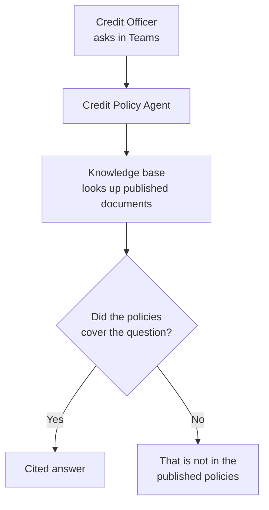
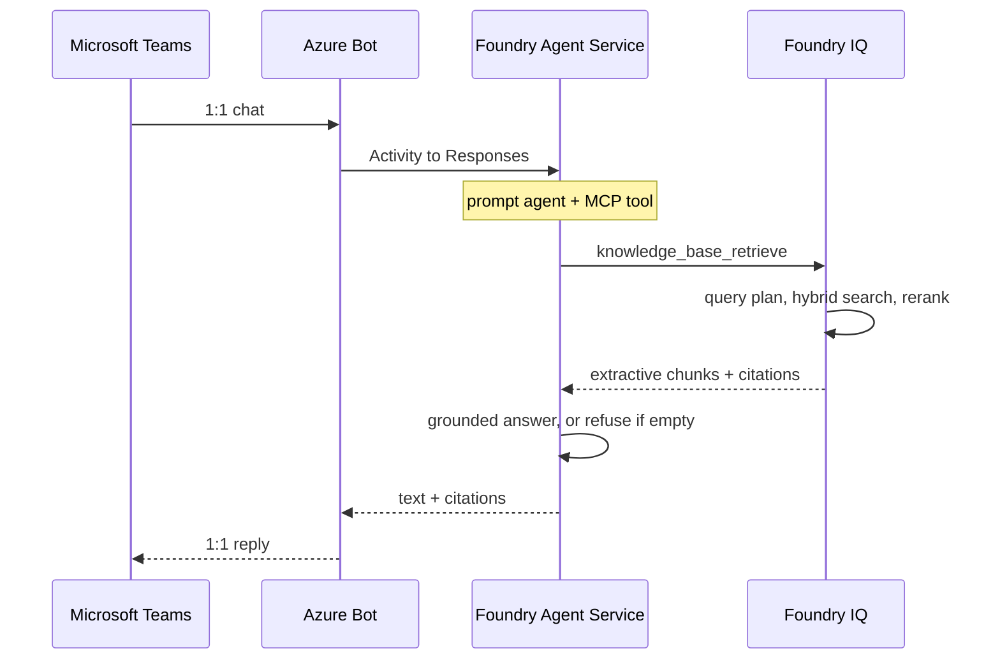
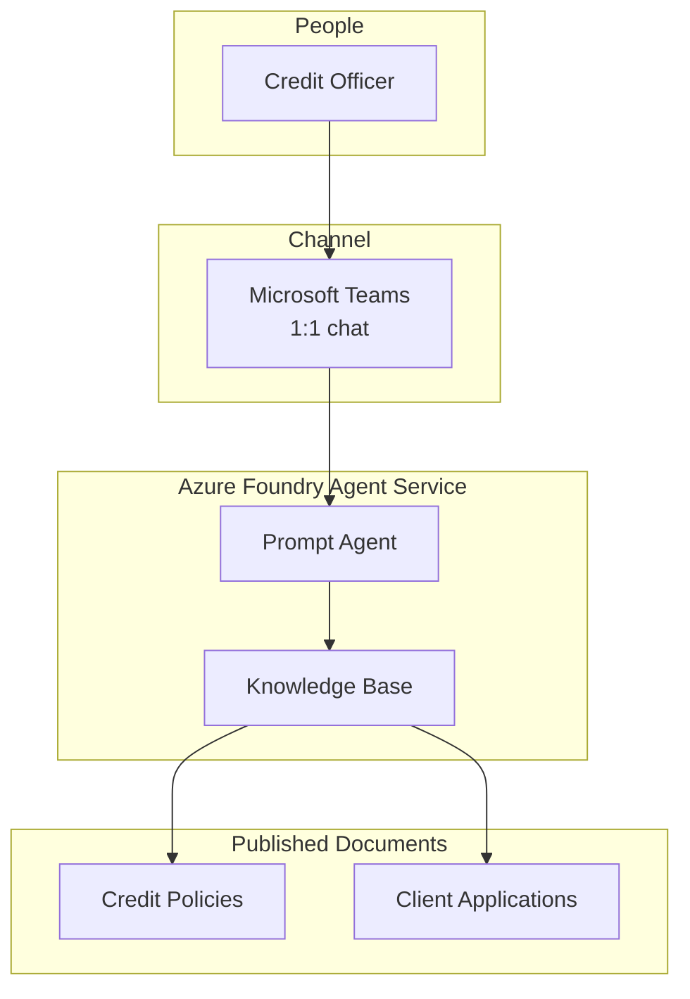
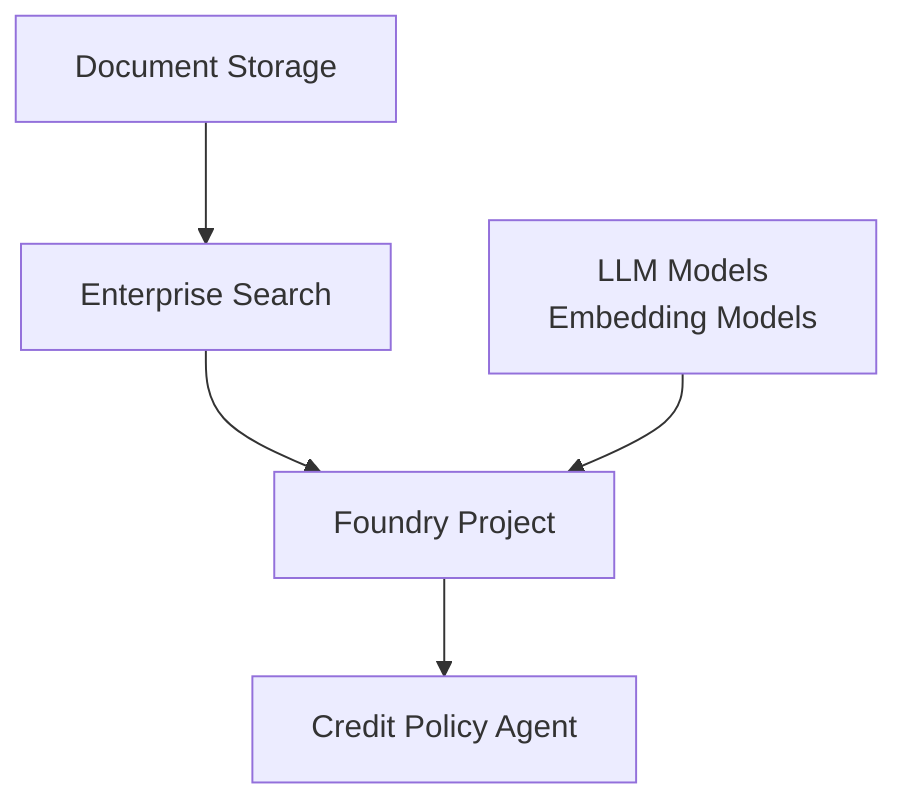
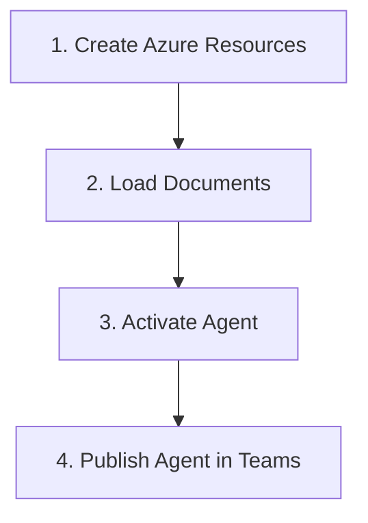

# Bank Credit Policy Agent Demo

A Microsoft Teams assistant that evaluates client applications against published credit policy and helps a credit officer process the file — with citations.

## Executive Summary

Credit officers process applications against published policy: read the filing, check LTV, DTI, and required documents, and record a decision. Today that means paging through policy PDFs while the deal is live. Generic chat models invent thresholds, committees, and eligibility rules.

This repository is a **demo**, not a production origination system. It shows a Foundry Agent Service assistant that evaluates a sample application and helps the credit officer work the file in Microsoft Teams, one-to-one. Name an application by number or customer; the agent compares it to twelve synthetic credit-policy documents, flags missing items, and returns a cited judgement — accept, reject, or missing-data. Policy lookup is in service of that workflow. If the published policies do not cover the question, the agent says so rather than guessing.

## How it works

**How a credit officer gets an answer**

**The agent does two jobs:**

- **Policy Q&A** — quote the number, the conditions, and the source document.
- **Application evaluation** — compare a sample filing to published policy and return accept, reject, or missing-data. Findings cite policy documents only.

**From Teams chat to a cited answer**

## Design

One agent, one knowledge base, one Teams channel. The documents are the source of truth; the model is not.

**One agent, one knowledge base, one channel**

Azure underneath is a single subscription with document storage, enterprise search, a Foundry project, and the chat and embedding models the agent uses.

**Azure resources**

## Azure Foundry Agent Service

Getting from this repository to a working Teams chat is four steps. An engineer runs them; the picture is the process.

**From repository to Teams**

1. **Create Azure Resources.** A development environment and a production-shaped environment. Each one gets document storage, enterprise search, a Foundry project, and the models the agent uses. Both environments are the same shape so a demo in the lab matches what production would look like.

2. **Load Documents.** The twelve synthetic credit policies (kept in this repository) and generated sample applications are uploaded and indexed. Until this step finishes, the agent has nothing grounded to quote.

3. **Activate Agent.** The prompt agent is created in Foundry with a single instruction: answer only from the knowledge base, and cite the source. It cannot invent LTV, DTI, or committee names, and it will not override published policy.

4. **Publish Agent in Teams.** Publish as a private 1:1 chat for the operator. If the tenant blocks that path, sideload the Teams app instead. A relationship manager then asks a policy question, or names an application to evaluate. See [docs/teams.md](docs/teams.md).

A production release repeats steps 2–4 against the live environment: refresh documents, re-index, keep the agent pointed at the published policies. Every code change is tested automatically; secrets are not stored in git.

This demo does not ship a second, container-hosted agent or a custom Teams bot. Foundry already bridges the prompt agent into Teams. Reopen that work only if a later version needs custom code inside the agent loop. See [docs/hosted-agents.md](docs/hosted-agents.md).
