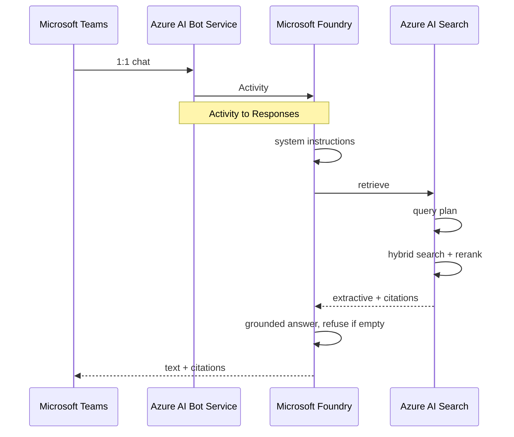

# Bank Credit Policy Agent Demo

A Foundry Agent Service prompt agent that answers credit-policy questions from a synthetic document corpus, with citations, in Microsoft Teams.

## Executive Summary

Relationship managers and credit officers need a cited answer to questions such as “what is max LTV on an investment property?” during a live deal. Today that means paging through policy PDFs. Generic chat models invent LTV, DTI, and committee names.

This repository is a **demo**, not a production credit system. It shows a Foundry Agent Service prompt agent grounded on a Foundry IQ knowledge base. The source of truth is twelve synthetic bank credit-policy Markdown files in Azure Blob Storage, dual-written locally so a presenter can open them. End users chat with the agent in Microsoft Teams 1:1.

## Runtime Sequence



## Azure Infrastructure

Azure Developer CLI (`azd`) with Bicep provision Storage, Azure AI Search (Basic), and a Microsoft Foundry project with `gpt-5-mini` and `text-embedding-3-large`. 

**Create Azure resources**

```bash
az login
azd auth login
azd env new dev
azd env set AZURE_LOCATION swedencentral
azd up
```

`azd up` deploys the resource group, Storage, Search, Foundry, model deployments, and RBAC. It does not create Foundry IQ objects. 

Copy outputs into gitignored `.env` 

```bash
cp .env.example .env
azd env get-values   # paste into `.env`
```

## Talos CLI

```bash
uv python pin 3.14 && uv python install 3.14   # once per clone
uv run talos --help
uv run talos generate --help
uv run talos deploy --help
```

## GitHub Actions

- [`.github/workflows/test.yml`](.github/workflows/test.yml) — every push and pull request: `uv run talos test` (unit marker, CPython 3.14).
- [`.github/workflows/deploy.yml`](.github/workflows/deploy.yml) — GitHub **release** `published` only (when `AZURE_CLIENT_ID` is set): OIDC login, `azd env select`, `uv run talos deploy --wait`, then live pytest markers.

Create a GitHub environment `credit-policy-live` and repository variables `AZURE_CLIENT_ID`, `AZURE_TENANT_ID`, `AZURE_SUBSCRIPTION_ID`, `AZD_ENV_NAME`. Federate a user-assigned identity to that environment. Do not put secrets in git.
