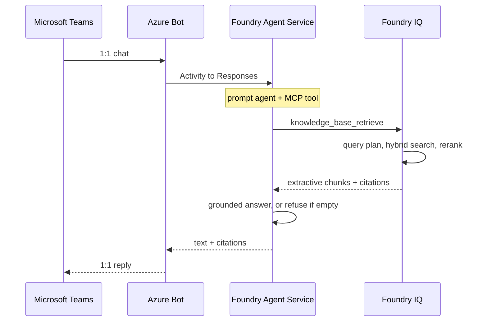

# Bank Credit Policy Agent Demo

A Foundry Agent Service prompt agent that answers credit-policy questions from a synthetic document corpus, with citations, in Microsoft Teams.

## Executive Summary

Relationship managers and credit officers need a cited answer to questions such as “what is max LTV on an investment property?” during a live deal. Today that means paging through policy PDFs. Generic chat models invent LTV, DTI, and committee names.

This repository is a **demo**, not a production credit system. It shows a Foundry Agent Service prompt agent grounded on a Foundry IQ knowledge base. The source of truth is twelve synthetic bank credit-policy Markdown files in Azure Blob Storage, dual-written locally so a presenter can open them. End users chat with the agent in Microsoft Teams 1:1.

## Runtime Sequence



## Azure Infrastructure

Terraform CLI in `infra/` provisions Storage, Azure AI Search (Basic), and a Microsoft Foundry project with `gpt-5-mini` and `text-embedding-3-large`. There is no `azure.yaml` and no Azure Developer CLI (`azd`).

**Create Azure resources**

Remote state lives in resource group `rg-credit-policy-tfstate` (not the workload `stcp*` storage account). Bootstrap once, then apply `dev1` or `prd1`:

```bash
gmake infra-backend-create   # once: tfstate RG + storage
gmake infra-create           # ENV=dev1 by default
gmake infra-create ENV=prd1
gmake infra-show             # terraform show for ENV
gmake infra-destroy ENV=dev1
gmake infra-backend-destroy  # drops the tfstate account
```

Equivalent:

```bash
az login
export ARM_SUBSCRIPTION_ID=<subscription>
export ARM_USE_AZUREAD=true
terraform -chdir=infra/backend init
terraform -chdir=infra/backend apply
terraform -chdir=infra init -migrate-state \
  -backend-config="storage_account_name=<tfstate-account>" \
  -backend-config="key=dev1.tfstate"
terraform -chdir=infra apply -var-file=dev1.tfvars
```

`terraform apply` deploys the resource group, Storage, Search, Foundry, model deployments, and RBAC. It does not create Foundry IQ objects. Environment names are `dev1` and `prd1` only.

`uv run talos generate` and `uv run talos deploy` fill missing canonical names from `terraform -chdir=infra output -json` unless you pass `--no-terraform`. CLI flags override process environment variables. A stray `.env` is gitignored and is not loaded. Terraform state (`*.tfstate`) is gitignored and is never committed. First `terraform init -migrate-state` copies local state to the azurerm backend.

## Talos CLI

```bash
uv python pin 3.14 && uv python install 3.14   # once per clone
uv run talos --help
uv run talos generate --help
uv run talos deploy --help
```

## GitHub Actions

- [`.github/workflows/test.yml`](.github/workflows/test.yml) — every push and pull request: `uv run talos test` (unit marker, CPython 3.14).
- [`.github/workflows/deploy.yml`](.github/workflows/deploy.yml) — GitHub **release** `published` only (when `AZURE_CLIENT_ID` is set): OIDC login, `terraform -chdir=infra init` with backend key `prd1.tfstate`, `uv run talos deploy --wait`, then live pytest markers.

Create a GitHub environment `credit-policy-live` and repository variables `AZURE_CLIENT_ID`, `AZURE_TENANT_ID`, `AZURE_SUBSCRIPTION_ID`. Federate a user-assigned identity to that environment. CI reads Terraform outputs when state is available; otherwise set the canonical Azure env vars on that environment. Do not put secrets in git.
