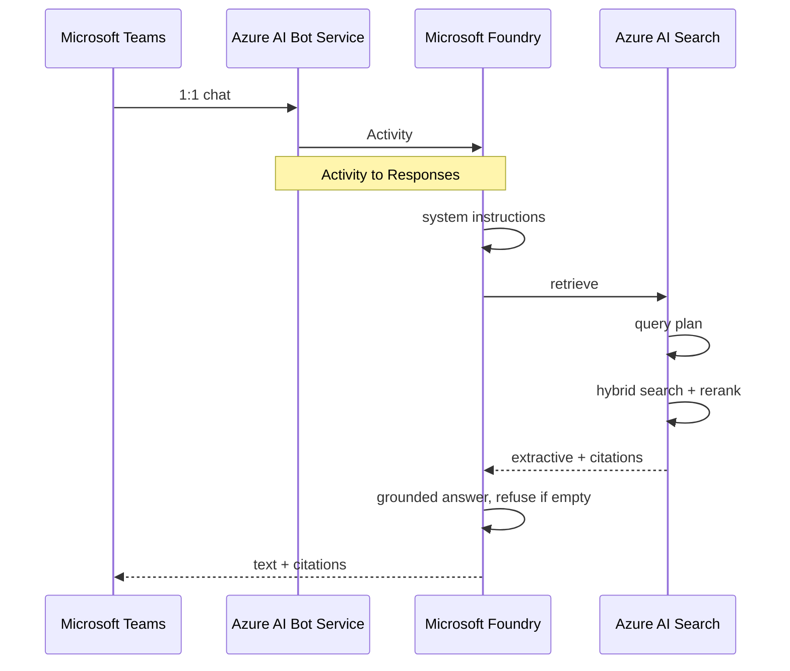

# Bank Credit Policy Agent Demo

A Foundry Agent Service prompt agent that answers credit-policy questions from a synthetic document corpus, with citations, in Microsoft Teams.

## Executive Summary

Relationship managers and credit officers need a cited answer to questions such as “what is max LTV on an investment property?” during a live deal. Today that means paging through policy PDFs. Generic chat models invent LTV, DTI, and committee names.

This repository is a **demo**, not a production credit system. It shows a Foundry Agent Service prompt agent grounded on a Foundry IQ knowledge base. The source of truth is twelve synthetic bank credit-policy Markdown files in Azure Blob Storage, dual-written locally so a presenter can open them. End users chat with the agent in Microsoft Teams 1:1.

The implementation is deliberately thin:

- **Talos** (`uv run talos`) is the project CLI. GitHub Actions uses it to deploy Foundry IQ objects and run tests.
- Bicep and Azure Developer CLI (`azd`) provision Storage, Azure AI Search (Basic), and a Foundry project with `gpt-5-mini` and `text-embedding-3-large`.
- `uv run talos deploy` creates the blob knowledge source, knowledge base, project MCP connection, and agent (replaces a one-off provision script).
- Pytest covers corpus, ingestion, retrieval, and the agent without a Teams tenant (`uv run talos test` or `uv run pytest`).
- Teams is a Foundry Agent Service publish step, not a custom Microsoft 365 Agents SDK host.

The agent answers only from retrieved policy. It cites the source document. It refuses questions that are not in the published files. Every document is watermarked `SYNTHETIC — DEMO ONLY`. There is no origination workflow, no real customer data, and no document-level access control.

The design plan is in [`docs/credit-policy-agent-plan.md`](docs/credit-policy-agent-plan.md).

## Talos CLI

Install nothing globally. From the repo root, `uv run` installs the `talos` console script into the project environment.

```bash
uv python pin 3.14 && uv python install 3.14   # once per clone
uv run talos --help
uv run talos deploy --help
```

| Command | What it does |
| --- | --- |
| `uv run talos deploy` | Idempotent Foundry IQ provision: knowledge source, generated indexer run, knowledge base, ARM MCP project connection, agent version. Fills missing env vars from `azd env get-values` unless `--no-azd`. |
| `uv run talos deploy --wait` | Same, then poll indexer status until at least 12 documents succeed (CI default). |
| `uv run talos deploy --dry-run` | Print the plan; no Azure calls. |
| `uv run talos test` | Run pytest. Extra args are forwarded (`uv run talos test -m unit`). Default `uv run pytest` is unit-only. |

Required env (Bicep/`azd` outputs; flags override): `AZURE_SEARCH_ENDPOINT`, `AZURE_AI_PROJECT_ENDPOINT`, `AZURE_AI_PROJECT_RESOURCE_ID`, `AZURE_STORAGE_RESOURCE_ID`, `AZURE_AI_SERVICES_ENDPOINT`. Missing env exits `2`.

After `azd up`:

```bash
az login
azd auth login
eval "$(azd env get-values)"          # bash; fish: talos will call `azd env get-values` itself
uv run talos deploy --wait
uv run pytest                         # unit
uv run pytest -m "ingestion or retrieval or agent" --override-ini addopts=
```

## Local loop (`gmake`)

GNU Make ≥ 4.4 (`gmake` on macOS). Recipes match the inner loop in sibling repos: check locally, deploy Azure with Talos, ship a GitHub release that CI deploys.

```bash
gmake check                 # ruff format --check, ruff check, unit pytest (no Azure)
gmake generate              # uv run talos generate --local-only
gmake preflight             # az account + azd env list
gmake deploy                # uv run talos deploy --wait
gmake e2e                   # check + preflight + live pytest markers
gmake e2e FILE=test_agent   # one live test file
gmake release patch         # bump, CHANGELOG, tag, push, gh release create
```

`gmake release major|minor|patch` does **not** deploy Azure itself. It publishes a GitHub release; [`.github/workflows/deploy.yml`](.github/workflows/deploy.yml) runs on `release: published`.

Working tree must be clean, `CHANGELOG.md` `## Unreleased` must have bullets, and `gh` must be logged in.

## GitHub Actions

- [`.github/workflows/test.yml`](.github/workflows/test.yml) — every push and pull request: `uv run pytest` (unit marker, CPython 3.14).
- [`.github/workflows/deploy.yml`](.github/workflows/deploy.yml) — GitHub **release** `published` only (when `AZURE_CLIENT_ID` is set): OIDC login, `azd env select`, `uv run talos deploy --wait`, then live pytest markers.

Create a GitHub environment `credit-policy-live` and repository variables `AZURE_CLIENT_ID`, `AZURE_TENANT_ID`, `AZURE_SUBSCRIPTION_ID`, `AZD_ENV_NAME`. Federate a user-assigned identity to that environment. Do not put secrets in git.

## Runtime Sequence


