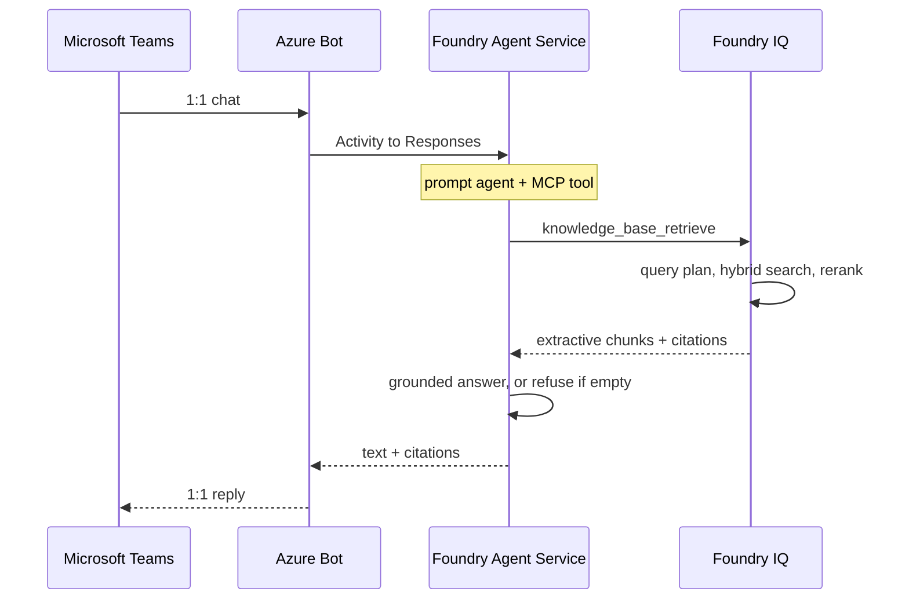

# Bank Credit Policy Agent Demo

A Foundry Agent Service prompt agent that answers credit-policy questions from a synthetic document corpus, with citations, in Microsoft Teams.

## Executive Summary

Relationship managers and credit officers need a cited answer to questions such as “what is max LTV on an investment property?” during a live deal. Today that means paging through policy PDFs. Generic chat models invent LTV, DTI, and committee names.

This repository is a **demo**, not a production credit system. It shows a Foundry Agent Service prompt agent grounded on a Foundry IQ knowledge base. The source of truth is twelve synthetic bank credit-policy Markdown files plus three gitignored synthetic client applications in Azure Blob Storage. End users chat with the agent in Microsoft Teams 1:1 for policy questions and application evaluation by `application_id` or `customer_name`.

## Runtime Sequence



## Azure Infrastructure

Terraform CLI in `infra/` provisions Storage, Azure AI Search (Basic), and a Microsoft Foundry project with `gpt-5-mini` and `text-embedding-3-large`. There is no `azure.yaml` and no Azure Developer CLI (`azd`).

**Create Azure resources**

Remote state lives in resource group `rg-credit-policy-tfstate` (not the workload `stcp*` storage account). Bootstrap once, then apply `dev1` or `prd1`:

```bash
gmake infra-backend-create   # once: tfstate RG + storage
gmake infra-plan             # terraform plan (ENV=dev1)
gmake infra-create           # ENV=dev1 by default
gmake infra-create ENV=prd1
gmake infra-show             # terraform show for ENV
gmake infra-destroy ENV=dev1
gmake infra-backend-destroy  # drops the tfstate account
```

Equivalent:

```bash
az login
export ARM_SUBSCRIPTION_ID=<subscription>
export ARM_USE_AZUREAD=true
az group create --name rg-credit-policy-tfstate --location swedencentral
az storage account create --name sttfstlab5 \
  --resource-group rg-credit-policy-tfstate --location swedencentral \
  --sku Standard_LRS --kind StorageV2 --min-tls-version TLS1_2 \
  --allow-blob-public-access false --https-only true
az storage container create --name tfstate --account-name sttfstlab5
az role assignment create --role "Storage Blob Data Contributor" \
  --assignee <operator-object-id> \
  --scope /subscriptions/<subscription>/resourceGroups/rg-credit-policy-tfstate/providers/Microsoft.Storage/storageAccounts/sttfstlab5
terraform -chdir=infra init -reconfigure \
  -backend-config="storage_account_name=sttfstlab5" \
  -backend-config="key=dev1.tfstate"
terraform -chdir=infra apply -var-file=dev1.tfvars
```

`terraform apply` deploys the resource group, Storage, Search, Foundry, model deployments, and RBAC. It does not create Foundry IQ objects. Environment names are `dev1` and `prd1` only.

`gmake infra-create` writes `infra/outputs.json` after apply. `uv run talos generate` and `uv run talos deploy` fill missing canonical names from that file unless you pass `--no-terraform`. They never spawn `terraform output`. CLI flags override process environment variables. A stray `.env` is gitignored and is not loaded. Terraform state (`*.tfstate`) and `infra/outputs.json` are gitignored and are never committed. Standing `terraform init -reconfigure` reconstructs the azurerm backend after clone.

## Talos CLI

```bash
uv python pin 3.14 && uv python install 3.14   # once per clone
uv run talos --help
uv run talos generate --help                  # group; bare command exits 2
uv run talos generate policy --local-only
uv run talos generate application --all --local-only
uv run talos deploy --help
uv run talos deploy --wait                    # blob-sync both corpora, two KS, two indexers
uv run talos publish --dry-run                # optional Teams Just-you REST
uv run talos publish
```

`talos generate` is a Click group. `talos generate policy` renders the committed 12 policy files and does not run deploy. `talos generate application` calls Foundry `gpt-5-mini` for a unique SyntheticBorrower (`--type` or `--all`; `--force` to overwrite a slot). Generated applications under `data/client-applications/` are gitignored. `talos deploy` hash-skips blob upload of both local corpora, PUTs `ks-credit-policies` and `ks-client-applications`, runs both indexers, and PUTs `kb-credit-policies` with both sources.

Teams publish is Just you (`BotServiceRbac`). Portal Direct publish or optional `uv run talos publish` (REST). Sideload is the fallback. See [docs/teams.md](docs/teams.md). Hosted agents and a custom Microsoft 365 Agents SDK host are not v1; see [docs/hosted-agents.md](docs/hosted-agents.md).

## GitHub Actions

- [`.github/workflows/test.yml`](.github/workflows/test.yml) — every push and pull request: `uv run talos test` (unit marker, CPython 3.14).
- [`.github/workflows/deploy.yml`](.github/workflows/deploy.yml) — GitHub **release** `published` only (when `AZURE_CLIENT_ID` is set): OIDC login, `terraform -chdir=infra init` with backend key `prd1.tfstate`, write `infra/outputs.json`, `uv run talos deploy --wait`, then live pytest markers.

Create a GitHub environment `credit-policy-live` and repository variables `AZURE_CLIENT_ID`, `AZURE_TENANT_ID`, `AZURE_SUBSCRIPTION_ID`. Federate a user-assigned identity to that environment. CI writes `infra/outputs.json` from Terraform state when it is available; otherwise set the canonical Azure env vars on that environment. Do not put secrets in git.
