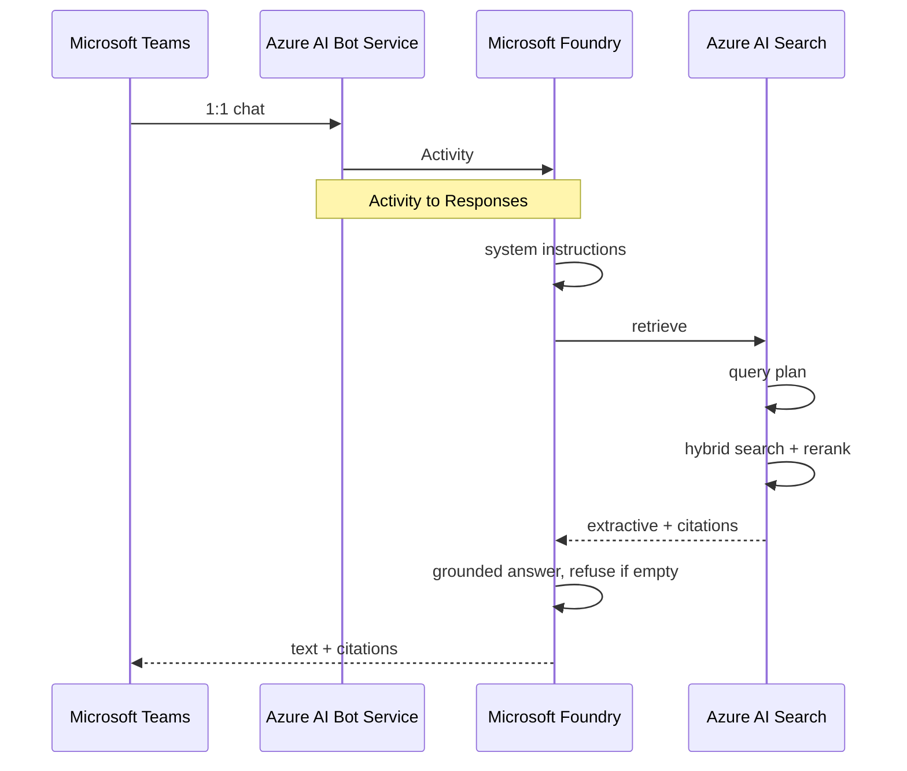

# Bank Credit Policy Agent Demo

A Foundry Agent Service prompt agent that answers credit-policy questions from a synthetic document corpus, with citations, in Microsoft Teams.

## Executive Summary

Relationship managers and credit officers need a cited answer to questions such as “what is max LTV on an investment property?” during a live deal. Today that means paging through policy PDFs. Generic chat models invent LTV, DTI, and committee names.

This repository is a **demo**, not a production credit system. It shows a Foundry Agent Service prompt agent grounded on a Foundry IQ knowledge base. The source of truth is twelve synthetic bank credit-policy Markdown files in Azure Blob Storage, dual-written locally so a presenter can open them. End users chat with the agent in Microsoft Teams 1:1.

The implementation is deliberately thin:

- A `uv` script generates the synthetic corpus.
- Bicep and Azure Developer CLI (`azd`) provision Storage, Azure AI Search (Basic), and a Foundry project with `gpt-5-mini` and `text-embedding-3-large`.
- A second script creates the blob knowledge source, knowledge base, project MCP connection, and agent.
- Pytest covers corpus, ingestion, retrieval, and the agent without a Teams tenant.
- Teams is a Foundry Agent Service publish step, not a custom Microsoft 365 Agents SDK host.

The agent answers only from retrieved policy. It cites the source document. It refuses questions that are not in the published files. Every document is watermarked `SYNTHETIC — DEMO ONLY`. There is no origination workflow, no real customer data, and no document-level access control.

The design plan is in [`docs/credit-policy-agent-plan.md`](docs/credit-policy-agent-plan.md).

## Runtime Sequence

